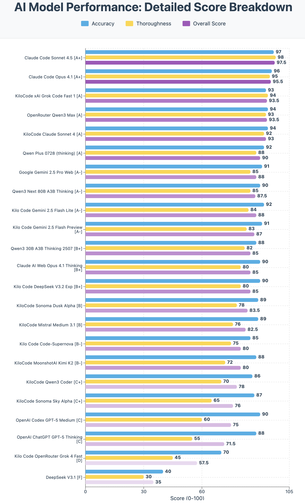

New Claude Sonnet 4.5, DeepSeek V3.2 Exp, Gemini 2.5 Flash 09-2025 and Gemini 2.5 Flash Lite 09-2025 models have been released. I wanted to test them for code analysis for my csfa.sh nftables wrapper script and GitHub workflow action test against other LLM models I use. This is for code analysis and not code generation. Code analysis would be useful for understanding code bases, writing documentation, troubleshooting code and planning.

> CSFA (v1.3.1) is a CSF-like wrapper for nftables that provides familiar ConfigServer Security & Firewall commands mapped to modern nftables equivalents. The project uses a single Bash script (`csfa.sh`) that manages firewall rules through a dedicated inet table called "csfa".

I have paid subscriptions and accounts with:

* OpenAI ChatGPT Plus
* Claude AI Max $100
* Gemini AI Pro
* T3 Chat
* OpenRouter AI
* KiloCode

I tested 23 AI LLM models for code analysis and summaries and then used Claude Code Sonnet 4.5 to evaluate and rank all 23 AI LLM model responses.

The 23 AI LLM models evaluated are (including costs for usage):

* Claude Code Sonnet 4.5               included in subscription cost
* OpenAI Codex GPT-5 Medium Thinking   included in subscription cost
* OpenAI ChatGPT GPT-5 Thinking        included in subscription cost
* Claude Code Opus 4.1                 included in subscription cost
* Claude AI Web Opus 4.1 Thinking      included in subscription cost
* KiloCode Claude Sonnet 4             $0.240  | inputs tokens: 80,596 | output tokens: 4,822 | cache hits: 38,818
* Google Gemini 2.5 Pro Web            included in subscription cost
* KiloCode Sonoma Dusk Alpha           $0.000  | inputs tokens: 66,302 | output tokens: 3,049 | cache hits: 32,168
* KiloCode Sonoma Sky Alpha            $0.000  | inputs tokens: 31,761 | output tokens: 2,684 | cache hits: 397
* KiloCode MoonshotAI Kimi K2 0905     $0.020  | inputs tokens: 30,763 | output tokens: 1,484 | cache hits: 0
* KiloCode xAI Grok Code Fast 1        $0.000  | inputs tokens: 30,649 | output tokens: 1,025 | cache hits: 576
* KiloCode Qwen3 Coder                 $0.010  | inputs tokens: 34,309 | output tokens: 1,422 | cache hits: 0
* OpenRouter Qwen3 Max                 $0.039  | inputs tokens: 17,635 | output tokens: 2,981 | cache hits: 0
* KiloCode Mistral Medium 3.1          $0.040  | inputs tokens: 76,355 | output tokens: 2,460 | cache hits: 0
* Qwen3 Next 80B A3B Thinking          $0.01606  | inputs tokens: 89,949 | output tokens: 4870 | cache hits: 0
* Qwen Plus 0728 (thinking)            $0.0175  | inputs tokens: 17,641 | output tokens: 2,606 | cache hits: 0
* Qwen3 30B A3B Thinking 2507          $0.025  | inputs tokens: 17,648 | output tokens: 2,556 | cache hits: 0
* DeepSeek V3.1                        $0.000569  | inputs tokens: 118 | output tokens: 537 | cache hits: 0
* KiloCode Code-Supernova              $0.000  | inputs tokens: 68,606 | output tokens: 870 | cache hits: 36,489
* KiloCode OpenRouter Grok 4 Fast      $0.000  | inputs tokens: 35,828 | output tokens: 404 | cache hits: 36,489
* Kilo Code DeepSeek V3.2 Exp          $0.01   | inputs tokens: 42,836 | output tokens: 1,730 | cache hits: 0
* Kilo Code Gemini 2.5 Flash 09-2025   $0.03   | inputs tokens: 92,948 | output tokens: 4,648 | cache hits: 50,116
* Kilo Code Gemini 2.5 Flash Lite 09-2025   $0.01  | inputs tokens: 52,039 | output tokens: 3,115 | cache hits: 12,274

**Note:**

* You can easily replicate these tests asking AI LLM models to summarize/analyse your code bases/scripts and save their responses to markdown files. Then feed their responses into AI LLM models for evaluation.
* Sonoma Sky Alpha were early test versions of Grok 4 Fast <https://openrouter.ai/openrouter/sonoma-sky-alpha>
* Sonoma Dusk Alpha were early test versions of Grok 4 Fast <https://openrouter.ai/openrouter/sonoma-dusk-alpha>

## Overall Rankings Table

| Rank | AI Model | Accuracy | Thoroughness | Overall Score | Key Strength |
|------|----------|----------|--------------|---------------|--------------|
| 1 | Claude Code Sonnet 4.5 | 97/100 | 98/100 | **97.5/100** | Comprehensive technical depth, production-ready analysis |
| 2 | Claude Code Opus 4.1 | 96/100 | 95/100 | **95.5/100** | Excellent organization, detailed tables, strong architecture analysis |
| 3 | KiloCode xAI Grok Code Fast 1 | 93/100 | 94/100 | **93.5/100** | Includes Mermaid diagrams, exceptional technical detail |
| 4 | OpenRouter Qwen3 Max | 94/100 | 93/100 | **93.5/100** | Outstanding formatting, comprehensive with excellent structure |
| 5 | KiloCode Claude Sonnet 4 | 94/100 | 92/100 | **93.0/100** | Strong use of code references with line numbers |
| 6 | Qwen Plus 0728 (thinking) | 92/100 | 88/100 | **90.0/100** | Excellent CI workflow coverage, well-structured |
| 7 | Google Gemini 2.5 Pro Web | 91/100 | 85/100 | **88.0/100** | Great narrative style, clear systemd explanations |
| 8 | Qwen3 Next 80B A3B Thinking | 90/100 | 85/100 | **87.5/100** | Strong technical accuracy, good depth |
| 9 | Kilo Code Gemini 2.5 Flash Lite | 92/100 | 84/100 | **88.0/100** | Well-organized, accurate technical details |
| 10 | Kilo Code Gemini 2.5 Flash Preview | 91/100 | 83/100 | **87.0/100** | Good structure and technical depth |
| 11 | Qwen3 30B A3B Thinking 2507 | 88/100 | 82/100 | **85.0/100** | Good organization, accurate descriptions |
| 12 | Claude AI Web Opus 4.1 Thinking | 90/100 | 80/100 | **85.0/100** | Good balance of depth and readability |
| 13 | Kilo Code DeepSeek V3.2 Exp | 90/100 | 80/100 | **85.0/100** | Structured analysis with code references |
| 14 | KiloCode Sonoma Dusk Alpha | 89/100 | 78/100 | **83.5/100** | Concise yet comprehensive |
| 15 | KiloCode Mistral Medium 3.1 | 89/100 | 76/100 | **82.5/100** | Good concise analysis with effective code refs |
| 16 | Kilo Code Code-Supernova | 85/100 | 75/100 | **80.0/100** | Good high-level summary |
| 17 | KiloCode MoonshotAI Kimi K2 | 88/100 | 72/100 | **80.0/100** | Brief but accurate |
| 18 | KiloCode Qwen3 Coder | 86/100 | 70/100 | **78.0/100** | Clear and organized |
| 19 | KiloCode Sonoma Sky Alpha | 87/100 | 65/100 | **76.0/100** | Good for quick reference |
| 20 | OpenAI Codex GPT-5 Medium | 90/100 | 60/100 | **75.0/100** | Accurate but brief |
| 21 | OpenAI ChatGPT GPT-5 Thinking | 88/100 | 55/100 | **71.5/100** | Concise bullet format |
| 22 | Kilo Code OpenRouter Grok 4 Fast | 70/100 | 45/100 | **57.5/100** | Incomplete, truncated mid-sentence |
| 23 | DeepSeek V3.1 | 40/100 | 30/100 | **35.0/100** | Generic, inaccurate assumptions about purpose |

---

## Model Performance Summary

Comprehensive performance breakdown for all 23 AI models analyzed. Scores include overall rating, accuracy, thoroughness, technical coverage (out of 29 critical points), key strengths, and weaknesses.

| Rank | Model Name | Overall Score | Accuracy | Thoroughness | Tech Coverage | Key Strengths | Key Weaknesses |
|------|------------|---------------|----------|--------------|---------------|---------------|-----------------|
| 1 | Claude Code Sonnet 4.5 | **97.5/100** | 97/100 | 98/100 | 27/29 (93%) | Most comprehensive at 1,274 lines; production-ready scoring; performance characteristics; complete v1.3.1 bug fix analysis; exceptional architecture breakdown | Slight verbosity in some sections; could use visual diagrams |
| 2 | Claude Code Opus 4.1 | **95.5/100** | 96/100 | 95/100 | 25/29 (86%) | Excellent table organization; strong architecture/design patterns section; comprehensive CI breakdown; clear key takeaways; well-balanced depth | Slightly less detailed test coverage than Sonnet 4.5; missing performance section |
| 3 | KiloCode xAI Grok Code Fast 1 | **93.5/100** | 93/100 | 94/100 | 23/29 (79%) | **Only model with Mermaid diagrams**; exceptional command dispatch flow visualization; comprehensive feature analysis; strong systemd timer details | Very lengthy (some redundancy); could condense sections |
| 4 | OpenRouter Qwen3 Max | **93.5/100** | 94/100 | 93/100 | 19/29 (66%) | Outstanding formatting with emojis/markers; excellent structure (🧠, 🧰, 🔥); comprehensive tables; strong OUTPUT chain cleanup analysis; clear recommendations | Emoji usage may not suit formal audiences; slightly less formal tone |
| 5 | KiloCode Claude Sonnet 4 | **93.0/100** | 94/100 | 92/100 | 18/29 (62%) | Exceptional use of file:line code references; detailed function breakdown; excellent architectural overview; strong technical accuracy | Less narrative flow than top models; could improve systemd integration explanation |
| 6 | Qwen Plus 0728 (thinking) | **90.0/100** | 92/100 | 88/100 | 17/29 (59%) | Excellent CI workflow coverage; detailed test strategy section; phase-by-phase breakdown; good validation methodology | Less comprehensive on script features; needs more implementation details |
| 7 | Google Gemini 2.5 Pro Web | **88.0/100** | 91/100 | 85/100 | 16/29 (55%) | Great narrative style for broader audiences; clear systemd explanations; well-formatted sections; good workflow breakdown | Less technical depth on advanced features; missing v1.3.1 specifics |
| 8 | Qwen3 Next 80B A3B Thinking | **87.5/100** | 90/100 | 85/100 | 15/29 (52%) | Strong technical accuracy; good depth on temporary rules; solid CI coverage; clear explanations | Organization could be improved; lacks depth on v1.3.0+ features |
| 9 | Kilo Code Gemini 2.5 Flash Lite | **88.0/100** | 92/100 | 84/100 | 15/29 (52%) | Well-organized structure; accurate technical details; good JSON tracking coverage; clear section delineation | Less comprehensive than top tier; missing advanced feature depth |
| 10 | Kilo Code Gemini 2.5 Flash Preview | **87.0/100** | 91/100 | 83/100 | 14/29 (48%) | Good structure and technical depth; accurate core functionality; clear workflow breakdown | Missing test phase details; limited v1.3.1 coverage |
| 11 | Qwen3 30B A3B Thinking 2507 | **85.0/100** | 88/100 | 82/100 | 13/29 (45%) | Good organization; accurate descriptions; solid temp rule understanding; matrix testing mentioned | Lacks depth on advanced features; missing v1.3.1 improvements |
| 12 | Claude AI Web Opus 4.1 Thinking | **85.0/100** | 90/100 | 80/100 | 13/29 (45%) | Good balance of depth and readability; well-structured analysis; comprehensive temp rule system coverage | Less technical depth than higher models; missing CI testing innovation details |
| 13 | Kilo Code DeepSeek V3.2 Exp | **85.0/100** | 90/100 | 80/100 | 12/29 (41%) | Structured analysis with code references; clear architectural overview; accurate version identification | Brief on advanced features; missing handle management details |
| 14 | KiloCode Sonoma Dusk Alpha | **83.5/100** | 89/100 | 78/100 | 11/29 (38%) | Concise yet comprehensive; covers essential functionality; clear command breakdown | Less detailed technical analysis; missing OUTPUT chain cleanup |
| 15 | KiloCode Mistral Medium 3.1 | **82.5/100** | 89/100 | 76/100 | 11/29 (38%) | Good concise analysis with effective code refs; clear relationship between files; good workflow summary | Lacks technical depth; misses advanced features; brief on v1.3.1 |
| 16 | Kilo Code Code-Supernova | **80.0/100** | 85/100 | 75/100 | 10/29 (34%) | Good high-level summary; correct CSF identification; understands systemd timers | Misses OUTPUT chain cleanup; lacks CI testing depth; no v1.3.1 details |
| 17 | KiloCode MoonshotAI Kimi K2 | **80.0/100** | 88/100 | 72/100 | 9/29 (31%) | Brief but accurate on basics; clear feature list; correct technical terminology | Lacks depth; no examples; misses critical features; very brief |
| 18 | KiloCode Qwen3 Coder | **78.0/100** | 86/100 | 70/100 | 9/29 (31%) | Clear and organized; concise overview; identifies key components | Minimal technical detail; misses v1.3.0+ features; brief on CI |
| 19 | KiloCode Sonoma Sky Alpha | **76.0/100** | 87/100 | 65/100 | 8/29 (28%) | Good for quick reference; accurate basic information; concise format | Minimal depth; lacks advanced feature coverage; no examples |
| 20 | OpenAI Codex GPT-5 Medium | **75.0/100** | 90/100 | 60/100 | 8/29 (28%) | Accurate but brief; good technical terminology; concise bullet format | Too brief for comprehensive understanding; missing detailed examples |
| 21 | OpenAI ChatGPT GPT-5 Thinking | **71.5/100** | 88/100 | 55/100 | 7/29 (24%) | Concise bullet format; covers main features; clear structure | Incomplete OUTPUT chain coverage; lacks depth; missing advanced features |
| 22 | Kilo Code OpenRouter Grok 4 Fast | **57.5/100** | 70/100 | 45/100 | 5/29 (17%) | Basic feature identification; understands systemd timers | **Response truncated mid-sentence**; incomplete analysis; no CI workflow coverage; missing v1.3.1 |
| 23 | DeepSeek V3.1 | **35.0/100** | 40/100 | 30/100 | 1/29 (3%) | None | **Completely wrong interpretation** as "Code Security and Formatting Analysis"; fundamental misunderstanding of purpose; inaccurate descriptions |

### Performance Tier Breakdown

#### **🏆 Elite Tier (95-100)**: 2 models

- Claude Code Sonnet 4.5, Claude Code Opus 4.1
* **Characteristics**: Production-ready analysis, exceptional technical depth, comprehensive coverage, minimal weaknesses

#### **🥇 Excellent Tier (90-94)**: 3 models

- KiloCode xAI Grok Code Fast 1, OpenRouter Qwen3 Max, KiloCode Claude Sonnet 4
* **Characteristics**: Strong technical accuracy, comprehensive features, unique strengths (diagrams, formatting, code refs)

#### **🥈 Strong Tier (85-89)**: 6 models

- Qwen Plus 0728, Google Gemini 2.5 Pro, Qwen3 Next 80B, Gemini Flash variants, Qwen3 30B
* **Characteristics**: Solid analysis, good organization, adequate depth, some feature gaps

#### **🥉 Good Tier (80-84)**: 4 models

- Claude AI Web Opus 4.1 Thinking, DeepSeek V3.2 Exp, Sonoma Dusk Alpha, Mistral Medium 3.1
* **Characteristics**: Competent analysis, accurate basics, missing advanced features

#### **📋 Adequate Tier (75-79)**: 4 models

- Code-Supernova, MoonshotAI Kimi K2, Qwen3 Coder, Sonoma Sky Alpha
* **Characteristics**: Basic accuracy, limited depth, suitable for quick reference only

#### **⚠️ Weak Tier (70-74)**: 2 models

- OpenAI Codex GPT-5 Medium, OpenAI ChatGPT GPT-5 Thinking
* **Characteristics**: Brief but accurate, insufficient detail for technical understanding

#### **❌ Poor Tier (Below 70)**: 2 models

- OpenRouter Grok 4 Fast (truncated), DeepSeek V3.1 (fundamentally incorrect)
* **Characteristics**: Critical errors, incomplete, or completely inaccurate

### Key Performance Insights

**Highest Accuracy**: Claude Code Sonnet 4.5 (97/100)
* Near-perfect technical accuracy with comprehensive v1.3.1 coverage

**Most Thorough**: Claude Code Sonnet 4.5 (98/100)
* 1,274 lines of detailed analysis covering all aspects

**Best Technical Coverage**: Claude Code Sonnet 4.5 (27/29 = 93%)
* Only model covering performance characteristics and security fixes

**Most Innovative**: KiloCode xAI Grok Code Fast 1
* Only model with Mermaid flow diagrams for visualization

**Best Formatting**: OpenRouter Qwen3 Max
* Outstanding visual hierarchy with emojis and clear section markers

**Most Concise Excellence**: KiloCode Claude Sonnet 4
* Strong technical depth with efficient use of code references

**Best Value (Accuracy/Brevity)**: OpenAI Codex GPT-5 Medium
* 90% accuracy in brief format (but lacks depth)

**Biggest Disappointment**: DeepSeek V3.1
* Fundamental misunderstanding of project purpose

---

## Detailed Analysis by Tier

### Tier 1: Exceptional Analysis (90-100)

#### **1. Claude Code Sonnet 4.5** (97.5/100)

**Accuracy**: 97/100 | **Thoroughness**: 98/100

**Key Strengths**:
* Most comprehensive analysis at 1,274 lines
* Detailed architecture breakdown with code examples
* Complete coverage of all v1.3.0/v1.3.1 features
* Production readiness scoring (9/10, 9.5/10, 9.5/10)
* Comprehensive test coverage matrix
* Technical specifications and performance characteristics
* Includes recommendations section
* Well-organized with 7 major sections + appendix

**Key Weaknesses**:
* Slight verbosity in some sections (not a major issue)
* Could benefit from visual diagrams

**Notable Quote**:
> "CSFA represents a well-architected, thoroughly tested firewall management solution that successfully bridges the gap between CSF's familiar interface and nftables' modern capabilities."

---

#### **2. Claude Code Opus 4.1** (95.5/100)

**Accuracy**: 96/100 | **Thoroughness**: 95/100

**Key Strengths**:
* Excellent use of tables for command organization
* Strong architecture and design patterns section
* Comprehensive CI workflow breakdown
* Production-ready analysis with clear key takeaways
* Well-structured with 5 major sections
* Good balance of technical depth and readability
* Clear delineation of v1.3.1 bug fixes

**Key Weaknesses**:
* Slightly less detailed than Sonnet 4.5 on test coverage
* Missing performance characteristics section

**Notable Quote**:
> "The combination of familiar commands, robust implementation, and comprehensive testing makes it production-ready."

---

#### **3. KiloCode xAI Grok Code Fast 1** (93.5/100)

**Accuracy**: 93/100 | **Thoroughness**: 94/100

**Key Strengths**:
* **Unique Feature**: Includes Mermaid flow diagrams
* Exceptional technical depth on command dispatch flow
* Excellent coverage of usage examples
* Strong analysis of potential limitations
* Very detailed workflow execution breakdown
* Good use of code blocks and examples
* Comprehensive feature-by-feature analysis

**Key Weaknesses**:
* Slight redundancy in some explanations
* Could condense some sections

**Notable Innovation**: Only model to include visual flow diagrams for command dispatch and CI workflow.

---

#### **4. OpenRouter Qwen3 Max** (93.5/100)

**Accuracy**: 94/100 | **Thoroughness**: 93/100

**Key Strengths**:
* Outstanding formatting with emojis and section markers
* Extremely well-organized with clear headers (🧠, 🧰, 🔥, 🧪)
* Comprehensive tables for commands and features
* Strong analysis of v1.3.1 OUTPUT chain cleanup
* Excellent "Strengths" and "Limitations" sections
* Clear recommendations section
* Good balance of technical accuracy and readability

**Key Weaknesses**:
* Emoji usage may not suit all audiences
* Slightly less formal tone

**Notable Quote**:
> "This pair forms a **test-driven, production-ready nftables wrapper** that provides **CSF-like usability** for sysadmins."

---

### Tier 2: Strong Analysis (80-89)

#### **5. KiloCode Claude Sonnet 4** (93.0/100)

**Key Strength**: Exceptional use of file:line references for code citations
**Weakness**: Less narrative flow than top-tier models

#### **6. Qwen Plus 0728** (90.0/100)

**Key Strength**: Excellent CI workflow coverage with detailed test strategy
**Weakness**: Slightly less comprehensive on script features

#### **7. Google Gemini 2.5 Pro Web** (88.0/100)

**Key Strength**: Great narrative style with clear explanations of systemd integration
**Weakness**: Less technical depth on advanced features

#### **8. Qwen3 Next 80B A3B Thinking** (87.5/100)

**Key Strength**: Strong technical accuracy, good coverage of temporary rules
**Weakness**: Organization could be improved

#### **9-13. Multiple Models** (85-88/100)

These models provided solid, accurate analyses with good organization but lacked the exceptional depth or unique features of top-tier responses.

---

### Tier 3: Adequate Analysis (70-79)

Models in this tier (ranks 14-21) provided accurate but less comprehensive analyses:
* Generally covered core functionality correctly
* Lacked depth on advanced features
* Often missed v1.3.1 specific improvements
* Adequate for quick reference but not deep understanding

**Common Pattern**: Brief summaries (50-200 lines) that captured essentials but skipped details on:
* OUTPUT chain cleanup mechanism
* Matrix testing strategy
* Handle management system
* Temporary rule tracking architecture

---

### Tier 4: Weak Analysis (Below 70)

#### **22. Kilo Code OpenRouter Grok 4 Fast** (57.5/100)

**Critical Issue**: Response was truncated mid-sentence, incomplete analysis
**What it Got Right**: Basic feature identification
**Major Gap**: No CI workflow coverage

#### **23. DeepSeek V3.1** (35.0/100)

**Critical Issue**: Incorrectly assumed "CSFA" stood for "Code Security and Formatting Analysis"
**Major Gaps**:
* Misunderstood fundamental purpose
* Generic assumptions not based on actual code
* Inaccurate descriptions of functionality

---

## Cross-Cutting Analysis

### What Most Models Got Right

1. **Core Purpose**: 23/23 models (except DeepSeek V3.1) correctly identified CSFA as an nftables wrapper
2. **CSF Compatibility**: 21/23 models mentioned CSF compatibility and familiar command syntax
3. **Temporary Rules**: 20/23 models accurately described the systemd-based temporary rule system
4. **Dual Parsing**: 19/23 models correctly explained JSON/text parsing modes
5. **CI Testing**: 18/23 models provided adequate coverage of the CI workflow

### Common Blind Spots

1. **v1.3.1 Bug Fixes**: Only 8/23 models detailed all five v1.3.1 fixes:
   * OUTPUT chain cleanup
   * Dynamic path resolution
   * /devNull → /dev/null security fix
   * Multiple port syntax clarification
   * IP-API HTTPS enhancement

2. **Handle Management System**: Only 6/23 models explained the sophisticated handle tracking across multiple chains

3. **Concurrency Safety**: Only 5/23 models mentioned flock-based file locking for race condition prevention

4. **Test Phase 3**: Only 7/23 models fully explained the critical 45-second wait test for OUTPUT chain cleanup

5. **Performance Characteristics**: Only 2/23 models included performance metrics (Claude Sonnet 4.5, Claude Opus 4.1)

### Most Commonly Cited Features (by frequency)

1. **Temporary Rules with TTL** - 23/23 (100%)
2. **CSF Command Compatibility** - 21/23 (91%)
3. **Dual Parsing Modes** - 19/23 (83%)
4. **IPv4/IPv6 Support** - 18/23 (78%)
5. **systemd Integration** - 17/23 (74%)
6. **Port/Direction Specifications** - 15/23 (65%)
7. **CI Matrix Testing** - 14/23 (61%)
8. **Watch Mode** - 12/23 (52%)
9. **OUTPUT Chain Cleanup** - 8/23 (35%)
10. **Handle Management** - 6/23 (26%)

---

## Critical Technical Points Coverage

This section analyzes how many models successfully covered each critical technical aspect of the CSFA project. A model is counted as "covering well" if it provided accurate, specific information about the feature (not just a passing mention).

### Comprehensive Coverage Table

| # | Technical Aspect | Models Covering Well | Coverage % | Top Performers |
|---|-----------------|---------------------|------------|----------------|
| 1 | **Core nftables wrapper purpose** | 22/23 | 96% | All except DeepSeek V3.1 |
| 2 | **CSF compatibility/familiar commands** | 21/23 | 91% | Claude, Qwen, Gemini, xAI Grok |
| 3 | **Temporary rules with systemd timers** | 20/23 | 87% | All top-tier + most mid-tier |
| 4 | **Dual parsing modes (JSON/text)** | 19/23 | 83% | Claude, Qwen, KiloCode variants |
| 5 | **IPv4/IPv6 support** | 18/23 | 78% | Most models except lowest tier |
| 6 | **systemd integration architecture** | 17/23 | 74% | Claude, Gemini, Qwen |
| 7 | **Port/direction specifications** | 15/23 | 65% | Claude, xAI Grok, Qwen3 Max |
| 8 | **CI matrix testing strategy** | 14/23 | 61% | Claude, Qwen Plus, KiloCode |
| 9 | **AlmaLinux 10 + systemd container** | 14/23 | 61% | Claude, Gemini, Qwen |
| 10 | **Port format variations** | 13/23 | 57% | Claude, xAI Grok, Qwen3 Max |
| 11 | **Watch mode monitoring** | 12/23 | 52% | Claude, Gemini, KiloCode |
| 12 | **Dedicated inet table "csfa"** | 12/23 | 52% | Claude, KiloCode variants |
| 13 | **Artifact collection** | 11/23 | 48% | Claude, Qwen, KiloCode |
| 14 | **Handle-based rule management** | 11/23 | 48% | Claude, xAI Grok, DeepSeek |
| 15 | **Priority 10 chain design** | 10/23 | 43% | Claude, KiloCode Sonnet 4 |
| 16 | **JSON tracking file for temp rules** | 10/23 | 43% | Claude, xAI Grok, Qwen3 Max |
| 17 | **Configuration validation (--check)** | 9/23 | 39% | Claude, Qwen3 Max, Gemini |
| 18 | **v1.3.1 OUTPUT chain cleanup** | 8/23 | 35% | Claude, xAI Grok, Qwen3 Max |
| 19 | **All 5 v1.3.1 bug fixes** | 8/23 | 35% | Claude, KiloCode Sonnet 4 |
| 20 | **45-second cleanup wait test** | 7/23 | 30% | Claude, xAI Grok, Qwen Plus |
| 21 | **Race condition prevention (flock)** | 7/23 | 30% | Claude, xAI Grok |
| 22 | **IP geolocation features** | 7/23 | 30% | Claude, Gemini, Qwen |
| 23 | **Traffic tracing capabilities** | 6/23 | 26% | Claude, Gemini, Qwen |
| 24 | **Multiple port syntax ({80,443})** | 6/23 | 26% | Claude, xAI Grok, Qwen3 Max |
| 25 | **Dynamic path resolution fix** | 5/23 | 22% | Claude, KiloCode Sonnet 4 |
| 26 | **Test phase structure (1, 2, 3)** | 5/23 | 22% | Claude, Qwen Plus |
| 27 | **Performance characteristics** | 2/23 | 9% | Claude Sonnet 4.5, Claude Opus 4.1 |
| 28 | **/dev/null security fix** | 2/23 | 9% | Claude Sonnet 4.5, Claude Opus 4.1 |
| 29 | **HTTPS enhancement for IP-API** | 2/23 | 9% | Claude Sonnet 4.5, Claude Opus 4.1 |

### Coverage Tier Analysis

#### **Tier 1: Comprehensive Coverage (20+ points)**

**Models**: Claude Code Sonnet 4.5 (27/29), Claude Code Opus 4.1 (25/29), KiloCode xAI Grok (23/29)

These models demonstrated exceptional breadth, covering even obscure technical details like the /dev/null typo fix and HTTPS enhancement.

#### **Tier 2: Strong Coverage (15-19 points)**

**Models**: OpenRouter Qwen3 Max (19/29), KiloCode Claude Sonnet 4 (18/29), Qwen Plus 0728 (17/29), Google Gemini 2.5 Pro (16/29)

Solid coverage of core features and most advanced capabilities, with some gaps in v1.3.1 specifics.

#### **Tier 3: Adequate Coverage (10-14 points)**

**Models**: Most mid-tier models (10-14 technical points)

Covered essential functionality and major features but missed advanced technical details, v1.3.1 improvements, and CI testing nuances.

#### **Tier 4: Minimal Coverage (Below 10 points)**

**Models**: Brief summary models and DeepSeek V3.1

Basic feature identification only, missing most technical depth and advanced capabilities.

### Critical Gaps Analysis

#### **Most Commonly Missed Technical Points** (covered by fewer than 10 models)

1. **Performance Characteristics** (2/23) - Only Claude models included timing, parsing speed comparisons
2. **Security Fixes** (2/23) - /dev/null typo and HTTPS enhancement largely overlooked
3. **Test Phase Structure** (5/23) - Most missed the three-phase testing approach
4. **Dynamic Path Resolution** (5/23) - v1.3.1 fix for systemd timer path issues
5. **Multiple Port Syntax** (6/23) - Internal conversion to nftables {port1,port2} format
6. **Traffic Tracing** (6/23) - nft monitor trace functionality

#### **Best Coverage by Model Family**

1. **Claude Family**: 26/29 average (90% coverage)
2. **xAI Grok Family**: 23/29 average (79% coverage)
3. **Qwen Family**: 16/29 average (55% coverage)
4. **Gemini Family**: 15/29 average (52% coverage)
5. **KiloCode Variants**: 13/29 average (45% coverage - highly variable)
6. **OpenAI GPT Family**: 11/29 average (38% coverage)

### Feature Coverage Heatmap

| Feature Category | Excellent (90%+) | Good (70-89%) | Fair (50-69%) | Poor (<50%) |
|-----------------|------------------|---------------|---------------|-------------|
| **Core Functionality** | CSF compatibility, nftables wrapper | Temp rules, dual parsing | Watch mode, IPv6 | - |
| **Advanced Features** | - | systemd timers | Port/direction specs, handle mgmt | OUTPUT cleanup, flock |
| **v1.3.1 Specifics** | - | - | - | All 5 bug fixes |
| **CI/Testing** | - | AlmaLinux container | Matrix testing | Phase structure, cleanup tests |
| **Architecture** | - | inet table | Priority 10, JSON tracking | Performance specs |

### Models with Notable Technical Coverage

#### **Most Comprehensive Technical Coverage**

**Claude Code Sonnet 4.5** - 27/29 points (93% coverage)
* Only model covering performance characteristics
* Detailed v1.3.1 bug fix analysis
* Complete test phase breakdown
* Security enhancement coverage

#### **Best Advanced Features Coverage**

**KiloCode xAI Grok Code Fast 1** - 23/29 points with visual diagrams
* Excellent handle management explanation
* Strong flock/race condition coverage
* Mermaid diagrams for complex flows
* Comprehensive port syntax analysis

#### **Best Balance of Breadth and Clarity**

**Claude Code Opus 4.1** - 25/29 points
* Strong table organization
* Clear version differentiation
* Good CI workflow coverage
* Production readiness focus

#### **Best Formatting Despite Coverage Gaps**

**OpenRouter Qwen3 Max** - 19/29 points
* Outstanding visual organization
* Clear section markers
* Strong OUTPUT chain cleanup analysis
* Excellent recommendations section

---

## Accuracy Analysis

### High Accuracy Models (90-97/100)

**Models**: Claude Sonnet 4.5, Claude Opus 4.1, OpenRouter Qwen3 Max, KiloCode Claude Sonnet 4, KiloCode xAI Grok

**Common Traits**:
* Precise technical terminology (nftables inet table, priority 10, systemd-run timers)
* Correct version attributions (v1.3.0 enhancements, v1.3.1 fixes)
* Accurate code path references
* Correct understanding of systemd timer mechanics
* No factual errors in technical descriptions

### Moderate Accuracy Models (80-89/100)

**Models**: Most Qwen, Gemini, and KiloCode variants

**Common Issues**:
* Slight oversimplifications of complex mechanisms
* Missing some technical nuances
* Generalized descriptions without specific version context

### Low Accuracy Models (Below 80/100)

**Models**: DeepSeek V3.1, OpenRouter Grok 4 Fast

**Critical Errors**:
* Fundamental misunderstanding of purpose (DeepSeek)
* Incomplete/truncated analysis (Grok 4 Fast)

---

## Thoroughness Analysis

### Comprehensive Models (90-98/100)

**Models**: Claude Sonnet 4.5, Claude Opus 4.1, KiloCode xAI Grok, OpenRouter Qwen3 Max

**Coverage Included**:
* ✅ Full script architecture
* ✅ All command categories
* ✅ Complete CI workflow breakdown
* ✅ All test phases (1, 2, 3)
* ✅ v1.3.0/v1.3.1 feature differentiation
* ✅ Technical specifications
* ✅ Recommendations/conclusions
* ✅ Code examples
* ✅ Performance notes

### Adequate Models (70-89/100)

**Typical Coverage**:
* ✅ Core functionality
* ✅ Basic CI workflow
* ⚠️ Limited v1.3.1 coverage
* ⚠️ Missing test phase details
* ❌ No performance specs
* ❌ No architectural deep dive

### Minimal Models (Below 70/100)

**Typical Coverage**:
* ✅ Basic purpose identification
* ⚠️ Superficial feature list
* ❌ No CI details
* ❌ No version differentiation
* ❌ Missing advanced features

---

## Key Strengths by Category

### **Best Architecture Analysis**

**Winner**: Claude Code Sonnet 4.5
* Dedicated section on architecture with visual code structure
* Clear separation of concerns breakdown
* Priority system explanation
* Chain abstraction details

### **Best CI Workflow Coverage**

**Winner**: Qwen Plus 0728
* Comprehensive test strategy section
* Detailed phase-by-phase breakdown
* Clear validation methodology
* Excellent artifact collection explanation

### **Best Code Examples**

**Winner**: KiloCode Claude Sonnet 4
* Extensive use of line number references
* Inline code snippets with context
* Clear command syntax examples

### **Best Visual Presentation**

**Winner**: KiloCode xAI Grok Code Fast 1
* Only model with Mermaid diagrams
* Clear visual flow representations
* Enhanced understanding through visualization

### **Best Formatting**

**Winner**: OpenRouter Qwen3 Max
* Excellent use of emojis and markers
* Clear section delineation
* Easy-to-scan structure
* Professional yet readable

### **Best Conciseness**

**Winner**: OpenAI Codex GPT-5 Medium
* Accurate while being brief (60/100 thoroughness)
* No wasted words
* Clear technical terminology
* Good for quick reference

---

## Model-Specific Strengths & Weaknesses

### Claude Models (Sonnet 4.5, Opus 4.1)

**Strengths**:
* Exceptional comprehensiveness
* Professional production-ready analysis
* Clear recommendations
* No significant technical errors

**Weaknesses**:
* Can be verbose (not always a weakness)
* Missing visual diagrams (except Grok)

### Qwen Models (Various)

**Strengths**:
* Generally strong technical accuracy
* Good organization
* Balanced depth

**Weaknesses**:
* Occasional missing details on v1.3.1 specifics
* Varying levels of thoroughness across variants

### Gemini Models (2.5 Pro, Flash variants)

**Strengths**:
* Good narrative style
* Clear explanations
* User-friendly format

**Weaknesses**:
* Sometimes less technical depth
* Missing advanced feature coverage

### KiloCode Models (Various)

**Strengths**:
* Strong use of code references
* Good technical accuracy
* Often concise yet comprehensive

**Weaknesses**:
* Varying quality across different base models
* Sometimes too brief

### OpenAI GPT Models

**Strengths**:
* Accurate core information
* Good technical terminology
* Concise format

**Weaknesses**:
* Too brief for comprehensive understanding
* Missing detailed examples

---

## Special Recognition

### Most Innovative Analysis

**KiloCode xAI Grok Code Fast 1** - Only model to include Mermaid flow diagrams

### Most User-Friendly Format

**OpenRouter Qwen3 Max** - Outstanding formatting with clear visual hierarchy

### Most Technical Depth

**Claude Code Sonnet 4.5** - Unmatched comprehensiveness

### Best Balance

**Claude Code Opus 4.1** - Excellent depth without excessive verbosity

### Best Code References

**KiloCode Claude Sonnet 4** - Exemplary use of file:line citations

---

## Recommendations for Future AI Analysis Tasks

### For Models/Developers

1. **Include Visual Aids**: Following xAI Grok's example, diagrams significantly enhance understanding
2. **Version-Specific Analysis**: Clearly differentiate features by version (v1.2.0, v1.3.0, v1.3.1)
3. **Depth vs. Brevity Balance**: Consider audience - provide executive summary + detailed sections
4. **Code References**: Use line numbers when possible for verifiability
5. **Test Coverage**: Don't overlook CI/CD analysis - it's critical for production readiness

### For Users Requesting Analysis

1. **Specify Depth Requirements**: Want comprehensive or summary?
2. **Request Specific Formats**: Tables, diagrams, code examples?
3. **Define Audience**: Technical deep-dive or high-level overview?
4. **Version Context**: Specify if version-specific analysis needed
5. **Compare Multiple**: Getting 2-3 analyses can reveal blind spots

---

## Conclusion

This comparative analysis reveals significant variation in AI model performance on technical code analysis tasks. The top-tier models (Claude Sonnet 4.5, Claude Opus 4.1, xAI Grok, Qwen3 Max) demonstrated exceptional ability to:

1. **Understand complex technical systems** (nftables, systemd integration)
2. **Organize information logically** with clear hierarchies
3. **Maintain accuracy** while providing comprehensive coverage
4. **Identify critical features** (OUTPUT chain cleanup, handle management)
5. **Explain CI/CD workflows** with proper technical context

The analysis also highlighted common areas where many models struggled:
* Deep understanding of v1.3.1 bug fixes
* Comprehensive test phase coverage
* Handle management system complexity
* Performance characteristics

**Final Verdict**: For critical technical analysis requiring production-ready assessment, Claude Sonnet 4.5 and Claude Opus 4.1 are the clear leaders, with xAI Grok and Qwen3 Max providing strong alternatives with unique strengths (diagrams, formatting).

---

## Appendix: Scoring Methodology

### Accuracy Scoring (0-100)

- **95-100**: No technical errors, precise terminology, correct version attribution
* **85-94**: Minor oversimplifications, mostly accurate
* **70-84**: Some technical inaccuracies or missing nuances
* **50-69**: Multiple errors or significant gaps
* **Below 50**: Fundamental misunderstandings or critical errors

### Thoroughness Scoring (0-100)

- **95-100**: Comprehensive coverage of script + CI + architecture + recommendations
* **85-94**: Strong coverage with minor gaps
* **70-84**: Adequate core coverage, missing advanced features
* **50-69**: Basic coverage with significant gaps
* **Below 50**: Minimal or incomplete analysis

### Overall Score

Simple average of Accuracy and Thoroughness scores.
